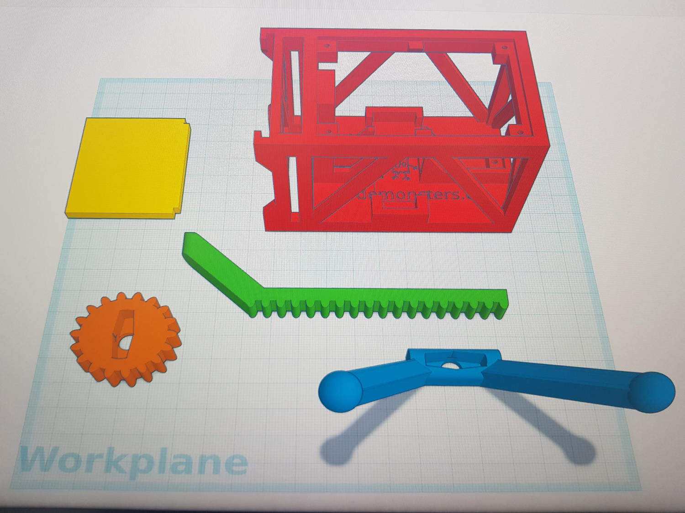

# Abercrombie

Robot cuadrúpedo didáctico y minimalista basado en una placa Arduino Nano, dos servos SG90 y varias piezas muy fáciles de imprimir.

Su diseño es extremadamente simple. Está pensado sobre todo para ser utilizado en el aula, pero también para todo aquel que quiera construir un primer robot desde cero.

([english version here](README.md))

## Motivación

El diseño general y particularmente el mecanismo que el robot usa para desplazarse está basado en un estupendo proyecto publicado por Randy Sarafan [accesible desde aquí](https://www.instructables.com/id/3D-Printed-Robot/). Tras verlo y construir uno siempre he pensado que un cuadrúpedo minimalista como el suyo es una gran idea y que para fines didácticos sería bueno contar con uno similar pero más pequeño, fácil de imprimir y que esté formado por componentes electrónicos incluso más económicos y fáciles de conseguir en cualquier sitio.

El robot está por tanto diseñado para ser construido, personalizado y programado en el aula. Pretende ser una base para que niños, jóvenes y por supuesto cualquier adulto pueda crear su primer robot capaz de caminar. Su diseño es en todos los aspectos simplista, intentando ser un buen primer proyecto incluso para personas no iniciadas en la programación, electrónica o impresión 3D.

El robot se puede utilizar en actividades educativas dedicadas a distintas áreas de la robótica:

* Tratar solo el diseño y la impresión 3D personalizando el robot con nuestros propios diseños y reducir el montaje a un trabajo en el que apenas es necesario utilizar una tijera y un destornillador.
* Dirigir más la actividad hacia la electrónica haciendo uso de placas perfoaradas, soldadores e incluyendo en el diseño diversos componentes electrónicos
* Utilizar el robot en actividades más centradas en la programación: definiendo las instrucciones que realizan cada movimiento o creando un programa que controle cualquier sensor o actuador que podamos tener conectado al robot.
* Participar en toda la problemática anteriormente citada.

## Características generales

Pros:

* Diseño simple, completamente abierto y con licencia muy permisiva (GPL3 para el código y CC BY-NC-SA 4.0 para las piezas 3D).
* Electrónica estándar y extremadamente simple: prácticamente solo dos servos SG90, una placa Arduino Nano, una placa de sensores Nano (o una placa perforada) y una pila de 9V.
* Impresión 3D sencilla: pocas piezas, de tamaño contenido e imprimibles sin necesidad de material de soporte.
* Personalizable: Además de crear nuevos diseños para cualquier de sus partes, el chasis cuenta con unos conectores en la parte frontal para añadir piezas diseñadas por nosotros.
* Extensible: En la placa perforada además de caber una placa Arduino Nano debería quedar espacio libre para añadir elementos extra: un zumbador, pulsadores, ledes, un sensor de ultrasonidos, resistencias LDR...
* Es un cuadrúpedo. Un poco torpe (pobriño...), pero con un aspecto y movimiento simpático y amigable.

Contras:

* Es un cuadrúpedo. Porque esto también es un inconveniente ya que su desplazamiento hace muy complicada su utilización en ciertas actividades en las que contar con unas ruedas sería mucho más adecuado (ej: al utilizarlo en un circuito siguelíneas).

## Amigable para el aula

El robot puede ser utilizado y además construido en el aula: es sencillo, el precio por unidad es muy reducido y los tiempos de impresión de las piezas necesarias son bastante razonables. Esto siempre que tratemos grupos pequeños o bien contemos con un número adecuado de impresoras hace viable construir uno por alumno.

Su diseño permite llevar a cabo actividades enfocadas hacia cualquiera de las ramas fundamentales de la robótica:
* Mecánica: Hace uso de una rueda dentada, cremalleras y servomotores.
* Electrónica: Es posible construir el robot soldando distintos elementos en una placa perforada estándar y añadir elementos nuevos. Por contra también es posible simplificar su construcción utilizando una shield de sensores para Arduino Nano, lo que eliminaría el uso de soldadores y componentes discretos, siendo solo necesarias las manos para conectar los motores a la placa.
* Programación: A pesar de sus capacidades motrices limitadas es posible programarlo para realizar movimientos hacia adelante, atrás y giros en ambas direcciones.

El chasis cuenta además con cuatro conectores en su parte frontal que permiten conectar piezas intercambiables. Estas piezas podrían ser diseños imprimidos en 3D creados con finalidad decorativa o bien funcional.

## Estado actual del proyecto

El diseño actual del robot ya permite que sea construido de ambas formas (con placa perforada o con shield de sensores) y realiza todos los movimientos básicos para los que fue diseñado (adelante, atrás y giros en ambas direcciones).

## Historial de versiones

* v1.4: Mejorado el diseño del chasis para que pueda albergar tanto una placa performada o una shield de sensores Nano.
* v1.3: Pequeñas modificaciones en el chasis para minimizar zonas de impresión completamente horizontales sin soporte.
* v1.2: Modificado el diseño chasis para que se pueda imprimir en menos tiempo y utilizando menos material.
* v1.1: Modificado el diseño de varias piezas para que se puedan imprimir sin soporte.
* v1.0: Primera versión funcionalmente completa.

## Galería

Capturas de pantalla (fotos hechas con el móvil... perdón) mostrando el diseño de las piezas 3D:

Chasis recién imprimido (sin material de soporte):

Sets de piezas preparados para ser utilizados en el aula:

Vídeo con sus primeros pasos (prototipo):

¡Están vivos! Robots construidos y personalizados durante una actividad:

Placa performada a la que además de soldar un Arduino Nano se le han añadido pulsadores para programar secuencias de movimientos, un zumbador, un led RGB y un interruptor de encendido:

Prototipo montado utilizando una sensor shield. Montaje plug & play: cero soldaduras, la conexión a la pila se realiza mediante un jack estándar y los servos se unen a la placa con el mismo conector dupont hembra triple que tienen cuando los recibimos, sin necesidad de modificaciones).

## Lista de materiales

* 1x placa Arduino Nano
* 2x Servos SG90
* Si quieres soldar elementos en una placa:
    * 1x placa perforada / perfboard
    * 1x zócalo para conectar la placa Arduino Nano
    * 1x interruptor que pueda ser soldado en la perfboard
    * 1x conector pila 9v LR6
    * Cualquier otro componente que quieras añadir: un zumbador, ledes, resistencias LDR...
* Si prefieres simplificar las cosas y no soldar nada:
    * 1x sensor shield para Arduino Nano (Nano Shield)
    * 1x conector pila 9v LR6 a jack de alimentación Arduino
* 1x pila 9v LR6
* Imprime estas piezas (los modelos están publicados en la carpeta [stl](./stl)):
    * 1x chasis
    * 1x rueda dentada
    * 1x patas traseras
    * 2x patas delanteras

## Construcción

Esquema básico de conexiones para su montaje utilizando una placa perforada:

El anterior esquema muestra un montaje sencillo, con conexiones entre los dos servos y la placa y un interruptor añadido para encender y apagar el robot. Colocando la placa con el conector USB hacia la derecha quedaría más espacio disponible para por ejemplo añadir pulsadores con los que programar una secuencia de movimientos, un zumbador para emitir sonidos, un led RGB o cualquier otro componente.

Una vez tengamos delante de nosotros las piezas imprimidas y el resto del material preparado, la mayor parte del procedimiento para montar el robot debería ser autoexplicativo. Posiblemente solo sea necesario comentar los siguientes puntos:

* Empeza cortando con un cutter los conectores plásticos que vienen con los servos para que uno quepa dentro de la rueda dentada y otro dentro de las patas traseras.
* Asegúramte que los dos servos están en su posición central antes de montarlos (puedes usar la misma pieza de plástico para centrarlos manualmente).
* Es posible que tengas que limar un poco la parte superior del hueco en el que se debe insertar el servo delantero. Los servos deberían insertarse con cierta resistencia, el diseño de estas zonas es deliberadamente justo (lo que permite prescindir de tornillos de sujección en la mayoría de los casos).
* Cuando coloques la parte delantera tendrás que insertar todos los elementos imprimidos juntos (las dos patas y la rueda). Piensa que estás colocando todo en su posición central y por tanto debería quedar aproximadamente el mismo número de dientes encima del eje del servo que debajo. Coloca las piezas, después atornilla el servo y opcionalmente fija el servo al chasis con dos tornillos.
* Los pies traseros tienen un diseño esfétrico para que opcionalmente se pueda añadir "calcetines" que mejoren el agarre a la hora de moverse (ej: dos pequeños globos de agua o cualquier otro material).

## Sketches Arduino

En la carpeta [src](./src) se han publicado los siguientes sketches Arduino de ejemplo:

* minimum.ino: Movimiento básico hacia adelante. Código didáctico y simplificado al máximo.
* abercrombie.ino: Tiene funciones para avanzar, desplazarse hacia atrás y girar en ambas direcciones. Añadidas definiciones para ajustar fácilmente el funcionamiento del robot según la posición inicial de cada servo (para facilitar su configuración a las pequeñas variaciones originadas durante el montaje).

## Colabora

Si construyes tu propio robot o lo utilizas en alguna actividad educativa envía por favor una foto. ¡Sería genial verlo!

¿Has realizado alguna mejora o modificación? ¡Comparte tu trabajo para para hacer este proyecto mejor!
