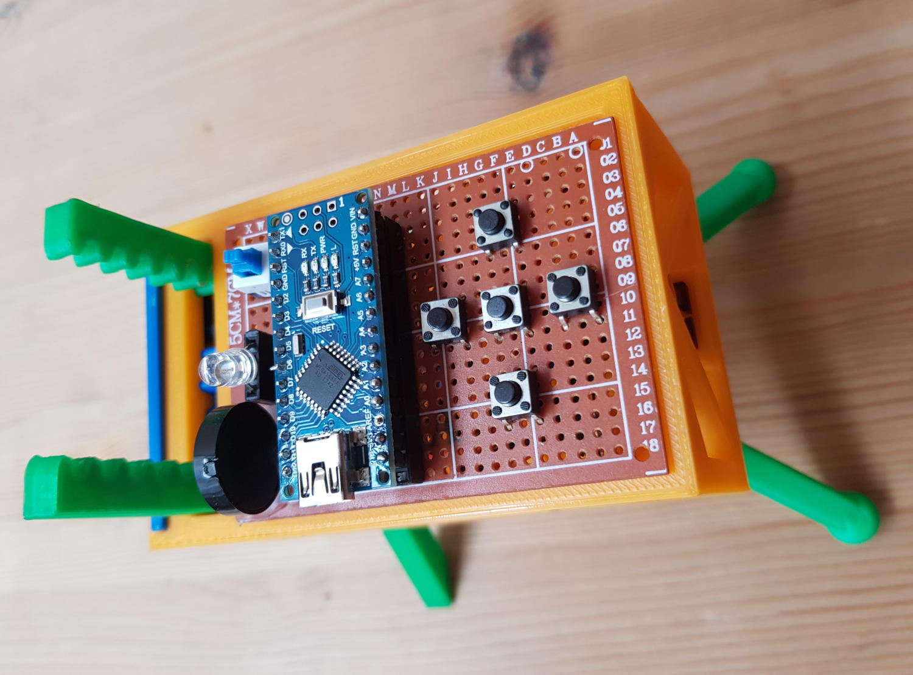

# Abercrombie

Four-legged educational and minimalist robot using an Arduino Nano board, two SG90 servos and five easy to print parts.

Its design is extremelly simple and it is meant to be used in the classroom or by anyone who wants to build his first robot from scratch.

([versión en español aquí](README.es.md))

## Motivation

The general design and also the mechanism that allows the robot to move around is based in an awesome project by Randy Sarafan [published here]((https://www.instructables.com/id/3D-Printed-Robot/)). After reaching the project for the first time and building one it seemed that a four-legged minimalist robot like his is a great idea and that for didactic purposes it would be great to have a similar one but just smaller, easier to print and build with components even cheaper and easier to find in any place you live.

So the robot was designed to be built, customized and programmed in the classroom. It wants to be a starting point so kids, teenagers and of course anyone else interested can created his first walking robot. Its design is intentionally simplistic, trying to be friendly even for people not initiated in programming, electronics or 3D printing.

The robot can be used in educational activities dedicated to different aspects of robotics:

* Work only in the design and 3D printing customizing the robot with our own designs, assembling it with just a scissor and a screwdriver.
* Turn the activity more into electronics making use of perfboards, soldering irons and including different electronic components.
* Use the robot for programming activities: defining the instructions that form every movement or creating programs that control any sensor or actuator we have attached to the robot.
* Treat all the pointed challenges together.

## General characteristics

Pros:

* Simple and completely open design with a very permissive license (GPL3 for the code and CC BY-NC-SA 4.0 for the 3D printed parts).
* Standard and extremelly simple electronics: mostly just two SG90 servos, one Arduino Nano board, a Nano sensor shield (or a perfboard) and a 9V battery.
* Very easy to print: just a few parts of reduced size that don't need support material while printing.
* Customizable: Creating new designs for any of his parts, but also because the chassis has connectors in the front area to attach any new piece designed by us.
* Extensible: After soldering an Arduino Nano board the perfboard should have enough free space to add extra components: a buzzer, LED lights, an ultrasonic sensor, LDR resistors...
* It is a four-legged robot. And a bit clumsy, but it is also friendly looking and funny while walking.

Cons:

* It is a four-legged robot. Sure this is also and disadvantage and his movement is not suited for certain activities where robots with wheels are much better (i.e.: using it with line following circuits).

## Friendly for the classroom

The robot can be used and also built in the classroom: it is simple, price per unit is very low and printing times for all the parts are quiet reasonable. Denpeding on the size of the group and the number of printers available it could be feasible to build one per student.

The design of the robot is suited to focus the activity in any of the main areas of robotics:
* Mechanics: It uses a gear wheel, gear racks and servomotors.
* Electronics: It is possible to build the robot soldering the needed components in a standard perfboard and add new elements. On the other hand is also possible to simplify its construction using an Arduino Nano sensor shield. That way one should just plug the connectors to the board using his bare hands.
* Programming: Even with its simplistic design, the robot can be programmed to walk forward, backwards and to turn in both directions.

The chassis of the robot has four connectors in the front to allow attaching swappable parts. These part could have aesthetic purposes (a new face for the robot) or even functional.

## Current state of the project

The current design of the robot is ready to be built with both kind of boards (sensor shield or perfboard) and it is also able to make all the basic movements it was meant for (walking forward, backward and turning in both directions).

## Version history

* v1.4: Design improvements in the chassis to allow attaching both a perfboard or a Nano sensor shield.
* v1.3: Small modifications in the chassis to minimize completely horizontal hanging areas.
* v1.2: Chassis design changed to be printed in less time and using less material.
* v1.1: Several parts modified to be printed without support material.
* v1.0: First working version.

## Gallery

Screenshots (pictures captured with the phone... sorry) showing the design of the parts:

Chassis just printed (no support material used):

Several sets of parts ready to be used in an activity:

Video with his first steps (prototype):

They are alive! Robots built and customized during an activity:

Perfboard with an Arduino Nano soldered but also with added temporary switches to program the sequence of movements, a buzzer, a RGB LED and a power switch:

Prototype that uses a sensor shield. Plug & play assembly: zero soldering, the connections between the battery and the board used a standard power jack and the servos are directly connected to the sensor board using its own triple DuPont female connector, no modifications needed).

## Bill of materials

* 1x Arduino Nano board
* 2x SG90 servos
* In case you want to solder everything:
    * 1x perfboard
    * 1x Arduino Nano socket
    * 1x power switch (breadboard friendly)
    * 1x LR6 9v battery connector
    * Any other component you want to add: a buzzer, LEDs, LDR resistors...
* If you choose to simplify things and avoid soldering:
    * 1x Arduino Nano Sensor Shield
    * 1x LR6 9v battery connector with an Arduino compatible jack
* 1x LR6 9v battery
* And print these parts (the models are published in the [stl](./stl) folder):
    * 1x chassis
    * 1x gear wheel
    * 1x rear legs
    * 2x forward legs

## Construction

In case you are using the Nano sensor shield the connections are just a matter of pluging the rear and the forward data cables of the servos (usually the orange ones to any two PWM enabled pins you want. Just remember to define the same pin numbers later in the sketch when you are programming the robot. Both red cables of the servos should be connected to a 5v output pin of the board and the brown ones to ground (GND).

If you prefer to use a perfbord you can use this basic electrical diagram as reference:

Former diagram shows a simple robot, with connections between the two servos and the board and an added power switch. Place the Arduino Nano board so it has the USB connector to the right if you want to have more free space to add extra components like switches to program sequences of movements, a buzzer to make sounds, an RGB LED or any other component.

Once you have the printed parts and the rest of the material ready, most of the assembly procedure should be self-explanatory. Anyway some details should be noted:

* Start cutting with a pair of scissors or an x-acto knife the plastic headers that come with the servo so that one of them fits inside the geared wheel and the other inside the rear legs.
* Make sure that both servos are in their center position before assembling them (the same plastic headers can be used to turn them manually until they are centered).
* Maybe you need to polish the upper part of the hole where the front servo needs to be attached. Anyway you will need to apply a bit of force to insert the servos because the design of this areas is deliberately tight (so you won't need extra screws for the servos in most of the cases).
* When assembling the frontal mechanism all the printed parts will have to be inserted simultaneously (two front legs and the wheel gear). Take in count that everything should be in the central position and so after placing all the frontal parts you should have more or less the same number of teeth over the axis of the motor than under itself. After finishing placing the parts tight the screw of the frontal servo and optionally secure the servo with two more screws.
* Rear feet have an spherical design to optionally add "sockets" to improve the grip while walking (i.e: two small water balloons or any other material).

## Arduino Sketches

In [src](./src) folder there are two example Arduino sketches:

* minimum.ino: Basic forward movement. Didactic code with maximum simplification.
* abercrombie.ino: It has functions to move forward, backward and turn in both directions. It also has added definitions to easily adjust how the robot works based on the center position of each servo (to correct by software the small calibration errors that could happen while trying to find the center position of each servo.

## Collaborate

If you build your own robot or you use it in any educational activity please send a picture. It would be great seeing it!

Did you make any improvement or modification? Share your work so we all can make this project better!
